# 🚀 Hey there, I'm Priyansh Singhal!

<div align="center">
  
</div>

<div align="center">
  
[](https://linkedin.com/in/priyanshsinghal1)
[](mailto:singhalpriyansh2005@gmail.com)
[](https://p-singhal-0011.github.io/Portfolio_Website/)

</div>

---

## 🎯 About Me

```python
class PriyanshSinghal:
    def __init__(self):
        self.name = "Priyansh Singhal"
        self.role = "Data Analytics | UI/UX Developer | Web Developer | Java Backend Developer"
        self.location = "Noida, India 🇮🇳"
        self.education = "B.Tech CSE @ Sharda University"
        self.interests = ["Machine learning", "Data Science", "Backend Development", "Data Analytics"]

    def current_focus(self):
        return ["Frontend Projects", "Dashboard Analytics", "ML Models"]

    def life_motto(self):
        return "Where data meets decisions, and models meet meaning"

me = PriyanshSinghal()
print(me.life_motto())
```

---
---

## 📊 Development Breakdown

### 🧠 AI & Machine Learning  


### 📊 Data Analysis & BI  


### ☁️ Cloud & Databases


### 🌐 Web Development  


### 🎨 UI/UX & Design  


### 🛠️ Dev Tools & Platforms  


---


---

## 📈 GitHub Stats & Activity

<div align="center">
  
  
</div>

<div align="center">
  
</div>

<div align="center">
  
</div>

---

## 🚀 Featured Projects
  
### 📊 Hospitality Revenue Analysis ([Repo](https://github.com/p-singhal-0011/Hospitality_Data_Analysis_Project))
- Built Power BI dashboard to diagnose market share drop
- Delivered 20% improvement in revenue trend insights

### 💡 Sales Insights Dashboard
- Visualized 4 years of sales data for AtliQ Hardware in Power BI
- Used SQL for transformation and KPI-driven metrics

### 🌱 AQI Prediction Using ML
- Developed regression models for predicting AQI to aid in environmental health assessment

### ❤️ Heart Disease Prediction
- Built classification models to forecast heart disease risk

### 🌐 Research Paper Platform - Bhramaand Inc.
- Sole developer of custom CMS using HTML/CSS/JS
- Focused on clean UX, navigation, cross-browser support

---

## 🏢 Internship Experience

### UI/UX Developer – Gaura Softwares (May 2024 – July 2024)
- Designed responsive UI with HTML, CSS, JS, Bootstrap
- Enhanced mobile experience and deployed via cPanel

### Web Developer – Bhramaand Inc. (June 2023 – Dec 2023)
- Built a full website from scratch for academic papers
- Emphasized design clarity and browser compatibility

---

## 🎯 Professional Journey

```mermaid
timeline
    title Priyansh's Tech Timeline

    2022 : Started B.Tech CSE (DS)
         : Sharda University

    2023 : Web Dev Intern at Bhramaand Inc.
         : Multiple Certifications
         : Frontend • JS • HTML/CSS

    2024 : Multiple Certifications
         : UI/UX Internship at Gaura Softwares
         : Responsive Design • Deployment
         : IIT Kharagpur

    2025 : Data Science Projects
         : Power BI • ML • Dashboards
```



---

## 📊 Development Breakdown

```text
UI/UX Design        █████████░░░░░░░░░░░   40%
Frontend Development███████░░░░░░░░░░░░░   30%
Cloud & Deployment  █████████░░░░░░░░░░░   40%
Data Science        ████████████░░░░░░░░   65%
Business Analytics  █████████████████░░░   85%
Machine Learning    █████████████░░░░░░░   70%
Power BI & Tableau  ██████████████░░░░░░   75%
Backend Development █████████░░░░░░░░░░░   40%
```

---

## 🌟 Current Focus

<div align="center">
  
🔥 **What I'm working on:**
- 📊 Real-time analytics dashboards with Power BI
- 💻 Building responsive frontend websites using HTML, CSS, JS & Bootstrap
- 🧠 Training ML & DL models

🌱 **What I'm learning:**
- 📈 Advanced Backend Engineering
- 🤖 Building better pipelines
- 🧩 Deepening understanding of statistics and business intelligence

</div>

---


## 📫 Let's Connect & Collaborate!

<div align="center">

💡 **Open to opportunities in:**
- Data Science & Analytics
- Research & Development
- Startup Collaborations
- UI/UX & Frontend Internships

[](https://linkedin.com/in/priyanshsinghal1)
[](mailto:singhalpriyansh2005@gmail.com)
[](https://p-singhal-0011.github.io/Portfolio_Website/)

**Let's build something amazing together! 🚀**


</div>

---

<div align="center">
  
</div>
